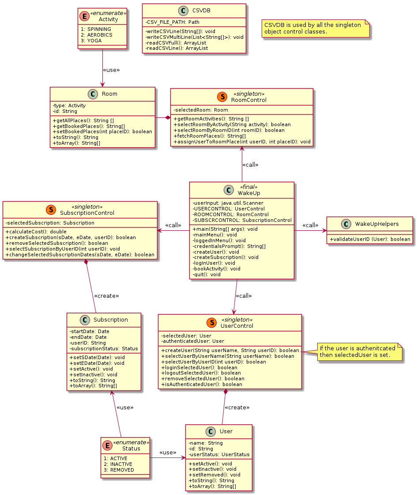

module name: A02_u01

# Assignment II - WakeUpGym
Java application that works towards a CSV database for persistance.

The purpose of the work is to learn basic Java and java best practices. The work is wholly my own, but nevertheless a product of discussion with teachers and other students.  

There are two secret menu items in mainMenu for testing purposes:

```java
case 3: // Secret case for making default rooms.
    generateDefaultRooms();
    break inputLoop;

case 4: // Secret case for booking an activity. Will fail because no userID.
    bookActivity();
```

### Discussion points
In the mirror project's repository (same course assignment) there is [Carl Granström](https://github.com/Carl-Granstrom/Assignment1). The following are some points to consider on the next student meeting.

#### Mirror project

* Constant variable alfabet should be final and in all uppercase


### Joblist
A few points that could be improved upon in the code in the repository. 

* repo: remove the current *.jar dependency files as included in src in this repository. Bring dependencies in dynamically for forks and clones of this repo.

### Style guide
This project attempts to conform to the following [style guide](https://github.com/weleoka/myJavaStyleGuide).

### UML diagram
The application has the following structure. This diagram is not a live view of the code implementation and requires manual updates. The Diagram is generated from PlantUML markdown language.



by Kai Weeks, student at Luleå Tekniska Universitet


